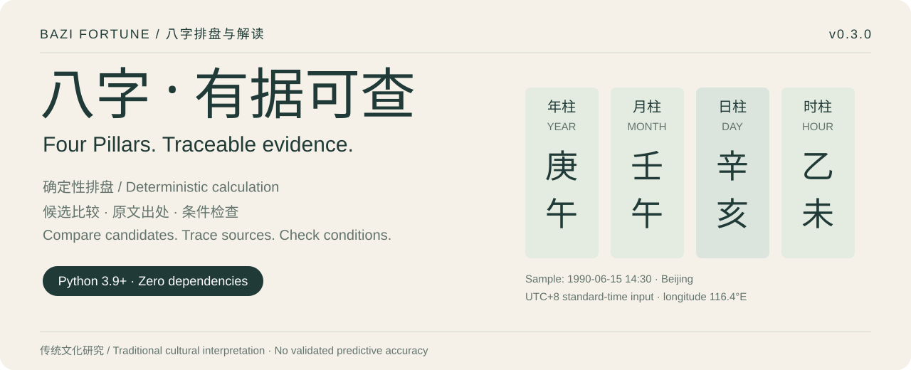
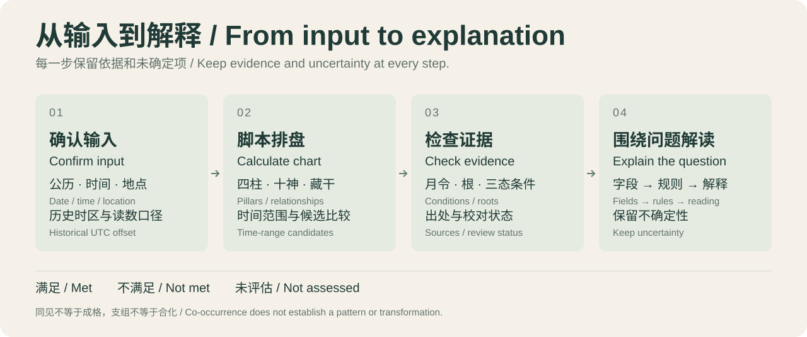
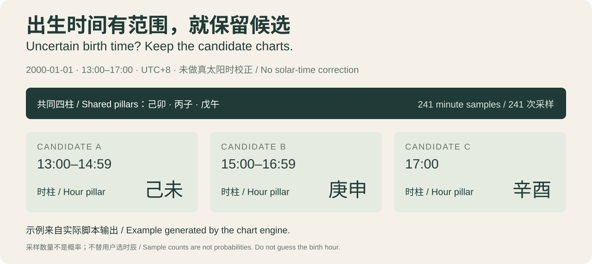

# Bazi · Four Pillars with Traceable Evidence

[中文](README.md) · [English](README.en.md)



[](LICENSE)


An offline Four Pillars (Bazi) calculation engine and an AI skill package. **Calculate the chart with deterministic scripts, then interpret its evidence using explicitly sourced traditional rules.** Preserve candidate charts when birth information is uncertain, and trace important statements back to fields, conditions, and sources.

Interpretation is a traditional cultural practice. This project has no validated accuracy for predicting real-world events. Software tests and astronomical calibration assess implementation and calculation, not the accuracy of fortune predictions.

## Capabilities

| Capability | Output and limits |
| --- | --- |
| Four Pillars and chart data | Year, month, day, and hour pillars; Ten Gods, hidden stems, Nayin, growth stages, and symbolic stars |
| Time conventions | Longitude and equation-of-time correction; explicit UTC offset, daylight saving, and late Zi-hour choices |
| Candidate comparison | Minute-by-minute birth-time ranges; shared and varying pillars; ranges of luck-cycle starting dates |
| Luck cycles and annual pillars | Dayun and Liunian; clashes, six harmonies, and complete three-branch groups involving natal or transit branches |
| Structural evidence | Month-command candidates, exact-stem and same-element roots, visible stems, and three-state condition checks |
| Classical references | A five-book reference catalog with review status, rule excerpts, and seasonal-reference chapter lookup |
| Focused interpretation | Chart fields → original rule conditions → cultural interpretation → uncertainty |

The main framework follows the month-command approach in *Zi Ping Zhen Quan*, with strength and seasonal considerations as supplements. The engine produces **candidates and clues**; it does not fully establish patterns, their failure or rescue, transformations, following patterns, or a unique useful element. Strength scores are project heuristics. Roots do not prove sufficient force, and co-occurrence does not establish a pattern.

## How the skill works



The assistant confirms the Gregorian date, clock reading, birthplace, and historical UTC offset. Gender is needed only for Dayun direction. Uncertain time becomes a user-approved range. Warnings come first, followed by condition checks and relevant references. Answers focus on the user's question; a full report is produced when requested.

## Quick start

Requires **Python 3.9+**. There are no third-party runtime dependencies.

```bash
git clone https://github.com/gezi71/Ba-Zi-skill.git
cd Ba-Zi-skill

# Markdown chart; longitude 116.4°E is the Beijing example
python scripts/bazi.py --date 2000-01-01 --time 14:30 --longitude 116.4

# JSON with Dayun
python scripts/bazi.py --date 2000-01-01 --time 14:30 \
  --gender male --longitude 116.4 --format json

# Unconfirmed daylight-saving reading: compare input assumptions
python scripts/bazi.py --date 1990-06-15 --time 14:30 \
  --gender male --longitude 116.4 --compare --format json

# Requested annual range; the example years are not defaults
python scripts/bazi.py --date 2000-01-01 --time 14:30 \
  --gender male --longitude 116.4 --liunian 2026-2030 -o report.md
```

Python API:

```python
from bazi import BirthInput, build_chart, compute_dayun

chart = build_chart(BirthInput(2000, 1, 1, 14, 30,
                             gender="male", longitude=116.4))
print({key: pillar.ganzhi for key, pillar in chart.pillars.items()})
info, periods = compute_dayun(chart, 8)
print(info.summary)
```

**The English documentation does not change the interface language.** CLI help, Markdown output, JSON keys, and most reference documents remain Chinese. Stems and branches retain their Chinese characters. Using `--longitude` avoids needing a Chinese city name.

## Preserve uncertain birth times



Generate this example with:

```bash
python scripts/bazi.py --date 2000-01-01 \
  --time-range 13:00-17:00 --format json
```

No birthplace or longitude is supplied, so this example uses UTC+8 clock time without solar-time correction. The inclusive range has 241 minute samples. The shared year, month, and day pillars are 己卯, 丙子, and 戊午; the hour pillars are 己未, 庚申, and 辛酉. **Sample counts are not probabilities.** Identical pillars can still have different Dayun starting dates; a representative chart is not the entire group's input range.

`--time-range 23:30-00:30` crosses midnight. `--compare` additionally checks applicable Chinese DST assumptions and solar-term reference shifts of −15/0/+15 minutes. Invalid DST assumptions appear under `排除情景` (excluded scenarios). See [uncertainty handling](references/uncertainty.md).

## What's new in 0.3.0

- **Reproducible calibration:** 48 Hong Kong Observatory solar-term records for 2024 and 2026, with raw data, UTC offset, SHA-256 checksums, and an offline calibration script.
- **DST transitions:** IANA 2026e PRC transition times for 1986–1991, including the correction of the 1988 start date to April 17. Missing clock readings require verification; repeated readings retain two candidates.
- **Structural facts:** existing strength scores are preserved, alongside exact-stem roots, same-element roots, and met / not met / not assessed checks for three structural clues.
- **Classical and reading evidence:** original text, later commentary, and project interpretation are separated. Core statements can be checked for field paths, rule IDs, and candidate ownership.

## Classical references

| Work | Role | Current review status |
| --- | --- | --- |
| *Zi Ping Zhen Quan* (子平真诠) | Month-command framework, changes, success/failure and rescue | Selected chapters have scan-review records; not a full collation |
| *Yuan Hai Zi Ping* (渊海子平) | Hidden stems and variants in foundational rules | Scan edition located; individual passages await review |
| *San Ming Tong Hui* (三命通会) | Alternative rules and edition context | A short Siku editorial excerpt; not checked against scans |
| *Di Tian Sui* (滴天髓) | Strength, overall structure, and seasonal considerations | Selected short excerpts; text and recorded commentary kept separate |
| *Qiong Tong Bao Jian* (穷通宝鉴) | Day-stem and solar-month seasonal lookup | Three short web excerpts await scan review; no automatic useful-element selection |

Entries preserve edition, chapter, link, scan location where available, and review status. Unverified text is not treated as a validated executable rule. Historical examples are not a prediction-accuracy dataset. See the [reference catalog](references/classics.md) and [pattern rules](references/patterns.md).

```bash
python scripts/query_classics.py --query 成败
python scripts/query_classics.py --day-stem 甲 --month-branch 寅
python scripts/check_reading.py --chart /tmp/chart.json --reading /tmp/reading.json
```

The reading checker validates field existence, rule IDs, declared categories, and candidate ownership. It cannot establish the fidelity of all natural-language statements. Review must still catch claims that promote a candidate into an established pattern, a branch group into a transformation, or a heuristic score into a useful element. See the [reading contract](references/reading_contract.md).

Useful JSON keys:

| Key | Meaning |
| --- | --- |
| `四柱` | Four Pillars |
| `告警` | Warnings |
| `传统结构` | Traditional structural evidence |
| `结构事实` / `结构条件检查` | Structural facts / condition checks, inside `传统结构` |
| `共同四柱` / `变化四柱` | Shared / varying pillars in comparisons |
| `候选` / `排除情景` | Candidate groups / excluded scenarios |
| `起运日期范围` | Dayun starting-date range within each candidate group |

## Accuracy and verification

The engine uses the low-precision solar coordinates in Chapter 25 of Meeus's *Astronomical Algorithms*. Offline comparison with the Hong Kong Observatory's 2024 and 2026 records yields:

| Sample | Count | Maximum absolute difference | Mean absolute difference |
| --- | --- | --- | --- |
| All solar terms in both years | 48 | 829.8 seconds, about 13.8 minutes | 313.5 seconds, about 5.2 minutes |
| Month-boundary terms in both years | 24 | 829.8 seconds, about 13.8 minutes | 342.1 seconds, about 5.7 minutes |

Published reference times have minute resolution. The largest sampled difference is an early calculation of Lixia in 2026. **15 minutes is a sample regression threshold and sensitivity window, not an all-year error bound.** An older 60-point record lacks its raw data; its approximately 10.5-minute result must not be treated as the current bound. [Hong Kong Observatory reference notes](https://www.hko.gov.hk/tc/gts/astronomy/Solar_Term.htm)

```bash
python scripts/calibrate_terms.py
python -m unittest discover -s tests
```

Local 0.3.0 verification includes **93 passing tests**. CI is configured for Windows, macOS, and Linux, each with Python 3.9, 3.11, and 3.13. Check [GitHub Actions](https://github.com/gezi71/Ba-Zi-skill/actions) for actual remote results.

There are also 40 frozen Four Pillars regression cases spanning 1940–2035. Other years lack independent accuracy guarantees. Delta T and equation-of-time approximations have not been independently calibrated; Dayun dates also depend on conversion conventions. See [calibration and historical time](references/calibration.md).

## Calculation conventions

| Item | Default and choices |
| --- | --- |
| Input calendar | Gregorian; no lunar-calendar conversion |
| Year / month boundaries | Exact computed Lichun instant / twelve month-boundary solar terms |
| UTC offset | Defaults to +8; overseas births require the actual historical offset, including local DST |
| Apparent solar time | Longitude plus equation of time when longitude is known; no correction otherwise |
| DST | Never silently subtract an hour; use `--dst-adjust` for confirmed supported readings; use `--tz` overseas |
| Late Zi hour | Default `next-day`; also `current-day`, `day-cur-time-next`, and `all-current` |
| Annual pillars | Whole Gregorian-year labels, not instant-by-instant Lichun transitions |
| Early historical dates | Compatibility hints, not a verified nationwide time regime |

If software disagrees, compare inputs and conventions first. See [English skill instructions](SKILL.en.md) and [convention decisions](references/decisions.md).

## Use as an AI skill

Keep the repository's relative directory structure intact, with `SKILL.md` as the entry point. For example:

```bash
git clone https://github.com/gezi71/Ba-Zi-skill.git ~/.codex/skills/bazi-fortune
```

[SKILL.en.md](SKILL.en.md) is the English instruction version. To use it as the entry point, copy its contents into `SKILL.md` **in your installed copy**. Both versions use the same scripts, data, and references; references and program output are currently mainly Chinese.

Example request:

> I was born in Beijing on June 15, 1990, around 2:30 p.m., with about half an hour of uncertainty. I'd like a reading focused on career.

The assistant confirms the time range and DST reading, runs the comparison, and discusses relevant evidence while preserving uncertainty. Full reports use the [report template](assets/report_template.md).

## Repository layout

```text
SKILL.md / SKILL.en.md       Chinese / English skill instructions
README.md / README.en.md     Chinese / English project introduction
bazi/                       Standard-library engine, evidence, and classical data
scripts/                    Chart, calibration, reference lookup, reading checks
references/                 Conventions, rules, sources, and interpretation limits
assets/calibration/         Offline raw benchmarks and source manifest
assets/images/              Introduction illustrations (SVG)
assets/report_template.md   Full-report template
tests/                      Calculation, boundary, evidence, and output regression
```

## Sources and license

- Reference project: [ziwei-doushu](https://github.com/Renhuai123/ziwei-doushu). Existing code and [convention records](references/decisions.md) document city-longitude data and calculation choices.
- Astronomy: Jean Meeus, *Astronomical Algorithms*, 2nd ed., 1998; a NOAA equation-of-time approximation and the existing approximate Delta T table.
- Calibration and historical time: [Hong Kong Observatory](https://www.hko.gov.hk/tc/gts/astronomy/Solar_Term.htm) and IANA 2026e. Source details and checksums are in [sources.json](assets/calibration/sources.json).
- Classical editions and review status: [classics.md](references/classics.md).

Project code is licensed under [MIT](LICENSE). Referenced material retains its own source and review status. The project provides no fate-changing, date-selection, or compatibility algorithms, and no medical, investment-trading, or life-and-death judgments from Bazi interpretation.
